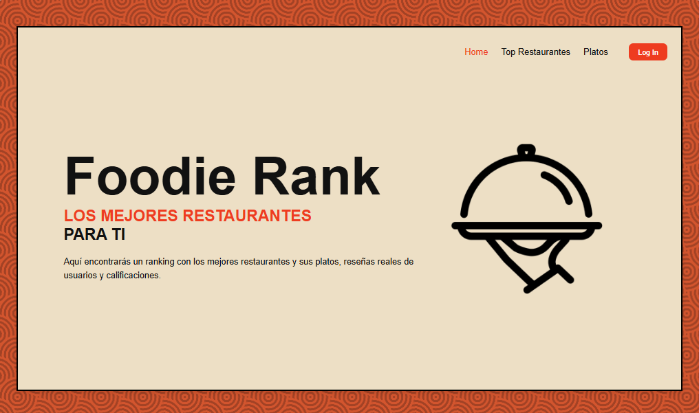
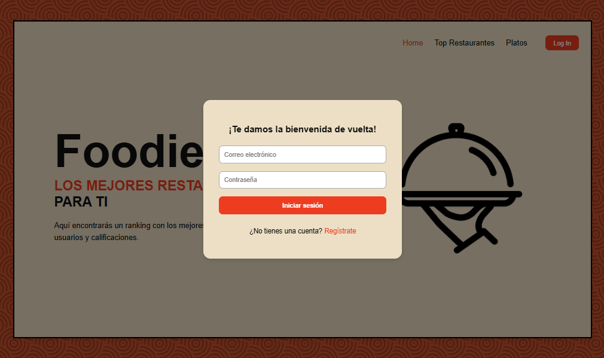

# 🍽️ Foodie Rank - Frontend

Este repositorio contiene el **Frontend** del proyecto **Foodie Rank**,
una aplicación web que permite registrar, calificar y rankear
restaurantes y platos. Está desarrollado con **HTML, CSS y JavaScript
puro**, consumiendo la API del backend implementado en Node.js +
Express.

------------------------------------------------------------------------

## 🚀 Tecnologías utilizadas

-   **HTML5** -- Estructura semántica de las páginas.
-   **CSS3** -- Estilos visuales y diseño responsive.
-   **JavaScript (Vanilla)** -- Lógica dinámica y consumo de API REST.

------------------------------------------------------------------------

## 🧭 Estructura del proyecto

    /foodie-rank-frontend
    │
    ├── index.html                 # Página principal (Inicio)
    ├── pages/
    │   ├── login.html             # Registro y Login de usuarios
    │   ├── restaurantes.html      # Listado de restaurantes
    │   ├── detalle.html           # Vista detalle del restaurante
    │   ├── perfil.html            # Perfil de usuario
    │   ├── admin.html             # Panel de administración
    │
    ├── css/
    │   ├── root.css               # Variables globales
    │   ├── style.css              # Estilos generales
    │   ├── perfil_style.css       # Estilos del perfil
    │
    ├── js/
    │   ├── main.js                # Control de la vista principal
    │   ├── restaurantes.js        # Renderizado dinámico de restaurantes
    │   ├── perfil.js              # Lógica del perfil de usuario
    │   ├── admin.js               # Panel de administración
    │
    └── images/                    # Recursos gráficos

------------------------------------------------------------------------

## 📱 Pantallas principales

1.  **Inicio**

 Presentación general del sitio y buscador de
    restaurantes.
    

2.  **Registro / Login** 

Formulario de autenticación e
    inicio de sesión.
    

3.  **Listado de Restaurantes** 
Renderiza todos los restaurantes
    disponibles desde el backend. Incluye filtros y buscador dinámico.
    
4.  **Detalle de Restaurante** -- Muestra información ampliada del
    restaurante, sus reseñas y permite agregar nuevas reseñas.
5.  **Panel de Administración** -- Vista dedicada para usuarios
    administradores con funciones CRUD completas.

------------------------------------------------------------------------

## 🌐 Consumo del backend

El frontend consume los endpoints del backend **Foodie Rank API**
alojado en `https://foodie-rank-backend.onrender.com`, incluyendo:

-   `/restaurantes` → Listar, crear, actualizar y eliminar restaurantes.
-   `/usuarios` → Registro, login y gestión de usuarios.
-   `/reseñas` → Crear y listar reseñas por restaurante.
-   `/categorias` → Obtener categorías disponibles.

------------------------------------------------------------------------

## ⚙️ Funcionalidades principales

-   ✅ Consumo dinámico de la API REST usando **fetch**.
-   ✅ Renderizado de tarjetas y modales de detalle.\
-   ✅ Formulario para agregar y editar reseñas.\
-   ✅ Panel de usuario con información del perfil y sus restaurantes.\
-   ✅ Diseño totalmente **responsive**.\
-   ✅ Manejo de errores y validaciones del backend.\
-   ✅ Modo administrador con control CRUD.

------------------------------------------------------------------------

## 💡 Características adicionales

-   Uso de **async/await** para manejo asíncrono.\
-   Implementación de **modales dinámicos**.\
-   Filtros por categoría y ranking.\
-   Separación clara de vistas y scripts.

------------------------------------------------------------------------

## 🧑‍💻 Instalación y ejecución

1.  Clona el repositorio:

    ``` bash
    git clone https://github.com/KarolainReyes/Foodie_Rank.git 

    cd foodie-rank-frontend
    ```

2.  Abre el archivo `index.html` directamente en tu navegador o usa un
    servidor local (por ejemplo con VSCode Live Server).

3.  Asegúrate de tener el backend corriendo en `https://foodie-rank-backend.onrender.com`.

------------------------------------------------------------------------

## 🧩 Requisitos

-   Navegador moderno compatible con ES6+\
-   Backend ejecutándose localmente o remoto

------------------------------------------------------------------------

## 🌐 Backend del proyecto

El Backend del proyecto se encuentra en un repositorio independiente.

🔗 [Repositorio del Backend - Foodie Rank](https://github.com/Andre07g/Foodie_Rank_Backend.git)

---

## 🧑‍💻 Autores
* [**Karol Reyes**](https://github.com/KarolainReyes) 
* [**Andres Leal**](https://github.com/Andre07g) 

Proyecto académico y práctico para la gestión y ranking de restaurantes y platos.

---

## 📄 Licencia
Este proyecto está bajo la licencia **MIT**. Puedes usarlo, modificarlo y distribuirlo libremente.
